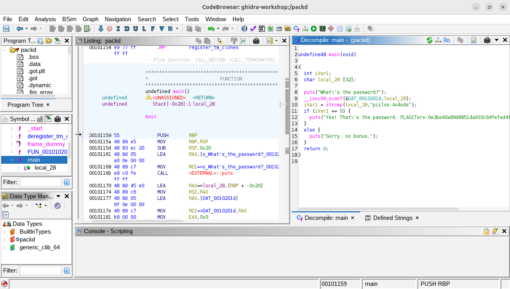
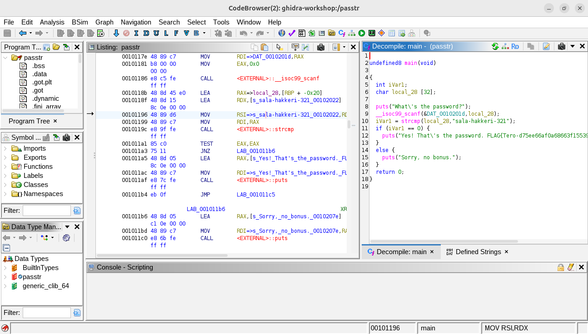
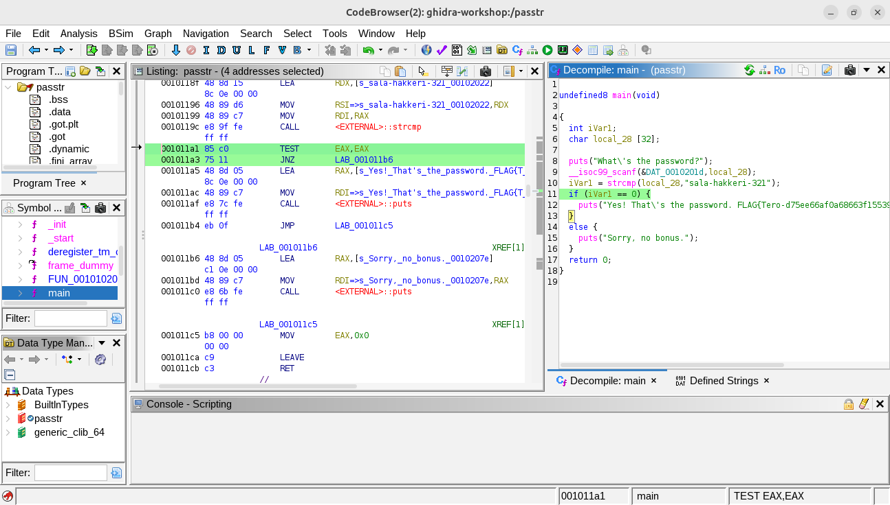
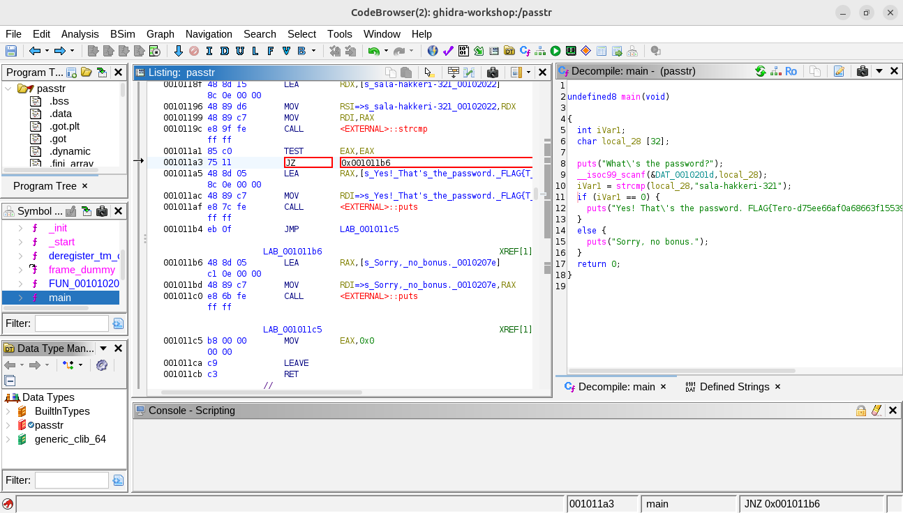
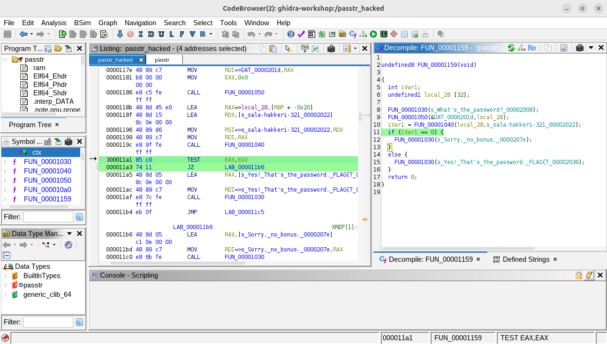
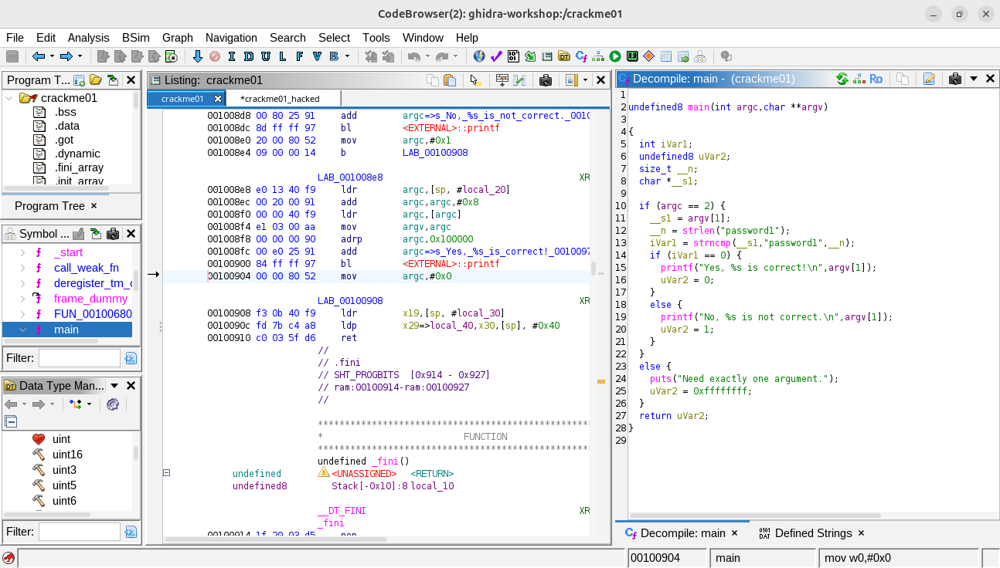
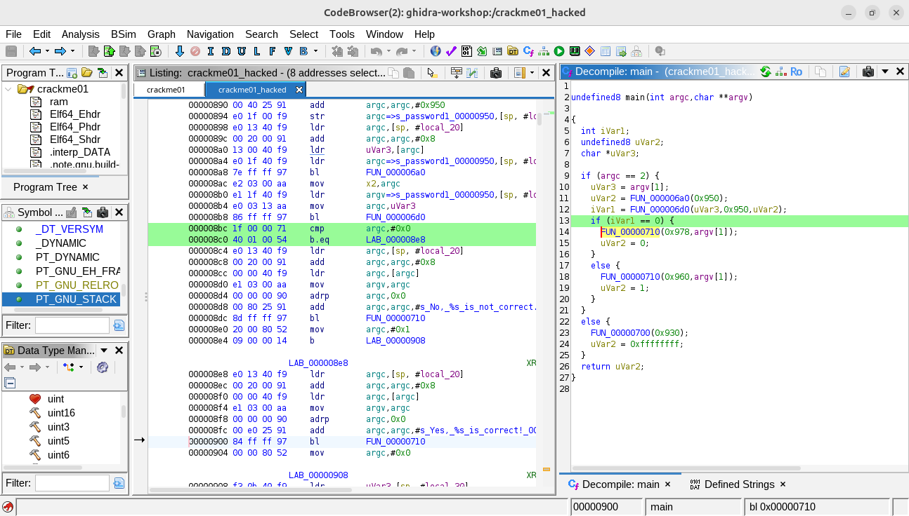
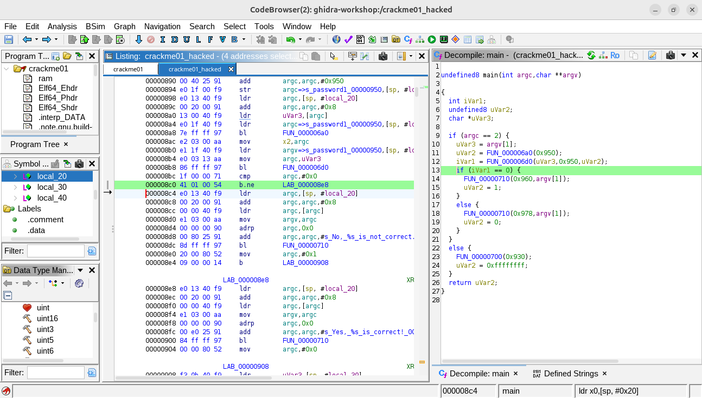

# Some Dissembly Required

## x) Read/watch/listen and summarize

* Hammond 2022: [Ghidra for Reverse Engineering (PicoCTF 2022 #42 'bbbloat')](https://www.youtube.com/watch?v=oTD_ki86c9I). In this video, John Hammond demonstrates how to solve a "reverse engineering" challenge from PicoCTF 2022. Here is a brief summary of the steps he takes:
    * He starts by running the program, which asks for a "favorite number." Since he doesn't know the answer, the program exits.
    * He tries several *basic tools* first like `ltrace`, `strace`, `gdb`, etc. to seek some *low hanging fruits*, but they don't provide the answer.
    * He then opens the file in Ghidra&mdash;a popular reverse engineering tool. By searching for the text "favorite number" in *defined strings*, he traces the exact place in the code where the check happens.
    * Inside the code, he discovers the hexadecimal value `0x86187` (i.e. `549255` in decimal) which is used to reveal the *flag* of the challenge&mdash;`picoCTF{...}`.

* Optional: € Eagle and Nancy 2020: [The Ghidra Book: 2. Reversing And Disassembly Tools](https://learning.oreilly.com/library/view/the-ghidra-book/9781098125684/xhtml/ch02.xhtml#ch02lev29). Look, I’d love to dive into *The Ghidra Book* and give you the summary of Chapter 2, but there’s a slight technical difficulty&mdash;my wallet is currently screaming *"Not enough minerals!"* I tried typing *"show me the money"* with my keyboard about fifty times, but apparently, it does not work. No 10,000 gas, no 10,000 minerals, and definitely no "free" access to O'Reilly's library for me either. Just `F10`, `E`, `Q` then.

## a) Install Ghidra

It's just easy peasy! All I have to do is just to follow the installation guides, here and there.

* Install [SDKMAN!](https://sdkman.io/)
```bash
$ curl -s "https://get.sdkman.io" | bash
``` 
* Install [JDK 21 64-bit](https://adoptium.net/temurin/releases)
```bash
$ sdk install java 21.0.9-ms
```
* Download the [release file](https://github.com/NationalSecurityAgency/ghidra/releases)
```bash
$ wget https://github.com/NationalSecurityAgency/ghidra/releases/download/Ghidra_12.0.2_build/ghidra_12.0.2_PUBLIC_20260129.zip
```
* Extract the Ghidra release file.
```bash
$ unzip ghidra_12.0.2_PUBLIC_20260129.zip
```

Because I'm using an ARM-based system, I have to perform some addition steps&mdash;but they are still *pieces of cake!*

* Install [Gradle](https://gradle.org/)
```bash
$ sdk install gradle
```
* Build Ghidra's native components
```bash
$ cd ghidra_12.0.2_PUBLIC/support/gradle/
$ gradle buildNatives
```

Let's reverse engineer!

## b) packd

> ***TL;DR;*** `piilos-AnAnAs` is the solution. By using Ghidra's **Analyze**, **Dissamble** and **Defined Strings** features, we can easily trace the entrypoint and the whole logic of the program.

Honestly, I struggled from the start. I couldn't apply anything I learned from the Ghidra workshop. No `strcmp`, no `__libc_` prefix, etc. Nothing! Even though I found a string `What's the password?` in the Defined strings window, but double clicking on it didn't lead me anywhere. Why? Is it that difficult? I remember Tero said to us that this is just a beginner level. Really?

Then, I read the tips again, and&mdash;wait! I realized this is the zip file used in the h3 homework. Was't it `packd` that was *packed*? Oh man, how could I miss that part? I scrambled back to my laptop, whipped open the terminal, and&mdash;with the extreme caution of a man who just realized he’s been trying to decompile a packed file for an hour&mdash;I retried every single step.

* Unpack the binary
```bash
$ upx -d packd
```
* Use Ghidra to open the unpacked version


*"Battlecruiser operational!"* `piilos-AnAnAs`

## c) Patch the passtr

> ***TL;DR;*** `passtr_hacked` is the solution. By using Ghidra’s **Patch Instruction** feature, we can edit a program's logic even without the source code.

Once I achieve a victory, I don't want to stop! You feel the same, right? Next opponent, please!

This time, the challenge is a bit trickier: I have to modify the code... *without* the code. Interesting! Let’s see how far I can go. 

As usual, I open Ghidra and summon the enemy!



A-ha! Lucky me! The logic is straightforward: ask for input, check it against a hard-coded value, and print whether it's right or wrong. 

**Mission Objective:** Modify the binary so it accepts all passwords except the correct one.

Isn't it just a matter of replacing `==` with `!=`? Easy peasy. I head back to Ghidra, place the cursor on the `==` operator, hit Delete, and&hellip; nothing. It's read-only. How do I do this in Ghidra? This tool is quite new to me, but I'll master it someday, I promise!

After some Googling, I discover that while I can't edit the decompiled C code directly, I can patch the instructions in assembly. Phew! Luckily, I’ve spent some time playing with assembly&mdash;a language definitely not meant for humans. 

In the mean time, I also find out that Ghidra has a great feature that highlights the corresponding assembly code when you select a line of C. 



Now, it's time to call for help from my ally&mdash;AI! I ask it: *"What do `TEST EAX, EAX` and `JNZ LAB_...` do?"*

Here is its answer.

> *In plain English: This sequence says: "Take a look at what's in EAX. If it's anything other than zero, go over to the section labeled LAB_.... Otherwise, just keep going."*&mdash;I just quote some of its response here for abbreviation.

Exactly what I thought! The *LAB_...* section handles the *"Sorry, no bonus"* message. Now, if I change `JNZ` (Jump if Not Zero) to `JZ` (Jump if Zero), I’ll invert the logic. The "if" becomes the "else". I must admit that I'm a genius!

I head back to Ghidra again, right click the `JNZ` instruction, select **Patch Instruction (Ctrl+Shift+G)**, change it to `JZ`, hit Enter, and&hellip;



&hellip;it reverts right back to `JNZ`. Nothing else happens. Again! What's wrong with you, Ghidra? Don't test my patience, please. I'm not giving up when I am this close to the finish line. 

I bury myself in forums, searching for a way to slay this final boss. Just when I think it is a "Game Over", I find a lifeline.

[Patching binaries with Ghidra](https://www.youtube.com/watch?v=8U6JOQnOOkg) &ndash; SoonerBourne

Following the video, I re-import the original binary into Ghidra (using **Raw Binary** option this time), analyze it, trace the jump instruction, patch it, save it, and export it. It works. I name it `passtr_hacked`.



Now it's time to eliminate the final boss and end my campaign.

```bash
$ ./passtr
What's the password?
test
Sorry, no bonus.
```
```
$ ./passtr_hacked 
What's the password?
test
Yes! That's the password. FLAG{Tero-d75ee66af0a68663f15539ec0f46e3b1}
```

GGWP! Another victory for me!

## d) Prepare for crackme challenges

Next, let's meet our new opponents! 

```bash
$ git clone https://github.com/NoraCodes/crackmes
$ cd crackmes/
$ gcc -Wall -o crackme01 crackme01.c
$ gcc -Wall -o crackme01e crackme01e.c
$ gcc -Wall -o crackme02 crackme02.c
$ gcc -Wall -o crackme02e crackme02e.c
```

**Important!** The pre-built binary *crackmes* monsters I built with Ubuntu ARM64. Remember to get well prepared before facing them in battles.

## e) crackme01

Another easy win!

* Import to Ghidra


* Analyze the source code



* Patch the source code




This is the enemy with 100% HP.

```bash
$ ./crackme01 || echo $?
Need exactly one argument.
255
$ ./crackme01 test || echo $?
No, test is not correct.
1
$ ./crackme01 password1 || echo $?
Yes, password1 is correct!
```

Enemy down!

```bash
$ ./crackme01_hacked || echo $?
Need exactly one argument.
255
$ ./crackme01_hacked test || echo $?
Yes, test is correct!
```

## e*) crackme01e

Not even a match!

```bash
$ ./crackme01e || echo $?
Need exactly one argument.
255
$ ./crackme01e test || echo $?
No, test is not correct.
1
$ ./crackme01e 'slm!paas.k' || echo $?
Yes, slm!paas.k is correct!
```

```bash
$ ./crackme01e_hacked || echo $?
Need exactly one argument.
255
$ ./crackme01e_hacked test || echo $?
Yes, test is correct!
$ ./crackme01e_hacked 'slm!paas.k' || echo $?
No, slm!paas.k is not correct.
1
```
